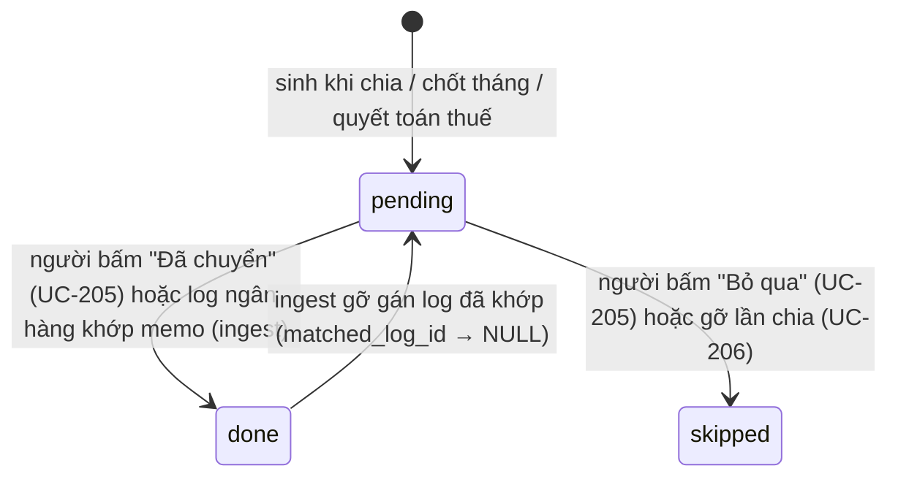

# Entity model — allocation

Context này sở hữu: **AllocationRule**, **IncomeStream** (kèm **IncomeStreamLock**), **AllocationRun**, **TransferOrder**, và hai "dạng bút toán" do nó sinh trên entity `Transaction`
(ledger sở hữu bảng): **FundEntry** và **SweepEntry**. Tham chiếu theo tên: `Wallet`, `Account`, `Transaction` (ledger), `BankLog`, `Rule` (ingest),
`Config` (access — key `salary_min_amount`; rental — key `rental_income_stream_id`), `Tenant` (rental).

---

## AllocationRule — luật nạp của một ví (`allocations`)
Số dự kiến của ví (và đích của quỹ `goal`) nằm ở **luật nạp**, không nằm ở ví (`migrations/0001_schema.sql` mục 4). Engine chỉ thấy luật `active = 1` của ví `active = 1`
(`loadRefs` trong `src/services/ledger.ts`), ghép với `tier`, `must_group`, `kind` của ví thành `WalletRule` (`src/domain/allocation.ts`).

| Trường | Ý nghĩa nghiệp vụ / luật |
|---|---|
| `mode` | `flat` · `percent` · `goal` · `lump` · `remainder` (CHECK). Quyết định cách tính nhu cầu, xem UC-201 |
| `period` | `week` → nhu cầu/sàn nhân với số thứ Hai của tháng (D7); `month`/NULL → nhân 1 |
| `amount` | `flat`: số tiền mỗi kỳ (CHECK bắt buộc khi `flat`). `lump`: số tiền của tháng (ưu tiên hơn `target_amount`) |
| `percent` | Tỷ lệ 0..1 (`0.30` = 30%) — CHECK bắt buộc khi `percent`; settings chặn ngoài [0,1] |
| `target_amount`, `target_date` | `goal`: đích và hạn (CHECK bắt buộc cả hai khi `goal`) |
| `floor_amount` | Sàn mỗi kỳ; chỉ có tác dụng với ví nhóm Must (`must_group='must'`). NULL = không có sàn → không bao giờ bị gắn `underfunded` |
| `priority` | Số nhỏ rót trước **trong cùng một bước**; cùng số → chia theo tỷ lệ nhu cầu |
| `split_weekly` | 0/1 (CHECK, `migrations/0007_income_streams_rental.sql`). Phong bì tháng chia đều theo tuần: chỉ hợp lệ với ví `kind='envelope'`, `mode` `flat`/`lump`, `period ≠ 'week'` — xin bật cho luật khác → `invalid_allocation`; đổi luật sang dạng không hợp lệ thì tự tắt (`src/services/settings.ts` › `splitWeekly`). **Không** đổi nhu cầu tháng ở engine; chỉ cho dự kiến tuần ở ledger (`weekTarget`, UC-103/UC-104) |
| `active` | Luật tắt thì ví không nhận gì từ engine |

**Invariants**
- Đúng **một** luật `remainder` đang active — engine ném `AllocationConfigError` nếu khác 1 (`allocate`); settings không cho tạo/đổi sang/khỏi `remainder` (`MODES` không chứa `remainder`, lỗi `remainder_fixed`) và không cho tắt ví đó (`required_wallet`) (`src/services/settings.ts`). Seed: ví `nice-to-have` (nhóm Have) — test `test/schema.test.ts` › "seed › có đúng một ví remainder (nhóm Have), một ví Tích sản, một ví Thu nhập".
- Tổng `percent` của các luật `percent` phe `wealth_building` + `tax` ≤ 1 — kiểm ở settings trước khi ghi (`percentTotalOk`, lỗi `invalid_allocation`) và ở engine (`AllocationConfigError` khi pool âm sau phần khóa).
- Thuế suất chỉ nằm ở `allocations` (ví `tax`, `percent = 0.1`), không ở `config` — test `test/schema.test.ts` › "seed › không còn danh mục học phí trỏ về ví Nhà ở; thuế suất chỉ nằm ở allocations".
- Hai ví Chơi cùng `priority` để lúc thiếu tiền chia đều — test `test/schema.test.ts` › "seed › hai ví Chơi cùng priority để lúc thiếu tiền không ai nhận 0".
- Sửa luật nạp thuộc UC-506 (access, "Sửa tài khoản & ví & luật nạp qua Cài đặt"); context này chỉ đọc.

## IncomeStream — nguồn thu (`income_streams`, migration 0007; ADR-59)
Mỗi khoản thu có thể gắn một nguồn (`transactions.income_stream_id`); nguồn quyết định **phần khóa** của lần chia thay cho luật `percent` toàn cục của Tích sản/Thuế (UC-201 2b). Không gắn nguồn = hành vi cũ.

| Trường | Ý nghĩa nghiệp vụ / luật |
|---|---|
| `id`, `name` | Mã/tên; tạo `POST /v1/settings/income-streams` (`id` không gửi thì sinh từ tên; trùng → 409 `duplicate`), sửa `PATCH /v1/settings/income-streams/:id` (404 nếu không có) |
| `sort` | Thứ tự hiển thị |
| `active` | Tắt = không chọn được khi nhập tay/gán (`inactive_income_stream`); xem trước và lần chia vẫn dùng được (UC-202, UC-203 [OPEN]) |

Seed (0007): `salary-husband` (không khóa — toàn bộ vào dòng thác), `salary-wife` (Tích sản 45%), `rental` (`rental-income` 100%, là nguồn mặc định cho tiền người thuê qua config `rental_income_stream_id`, ADR-63).
Gắn nguồn: nhập tay/gán chọn tay; tiền người thuê không chọn thì lấy nguồn cho thuê; rule lương mang `rules.income_stream_id` (chỉ rule `income` — `income_only` khi tạo, `invalid_input` khi sửa qua Cài đặt) cho khoản tự ghi.

## IncomeStreamLock — phần khóa của một nguồn (`income_stream_locks`, migration 0007)
| Trường | Ý nghĩa nghiệp vụ / luật |
|---|---|
| `stream_id`, `wallet_id` | PRIMARY KEY — mỗi ví khóa tối đa một lần trong một nguồn |
| `percent` | Tỷ lệ của **chính khoản thu**, CHECK `0 < percent ≤ 1`; engine lấy `floor(amount × percent)` |
| `sort` | Thứ tự; lock đầu tiên nhận đồng lẻ khi tổng = 100% |

**Invariants**
- Không có dòng nào = khóa 0%: cả khoản thu chạy dòng thác, không cắt Tích sản/Thuế.
- Σ `percent` của một nguồn ≤ 1 — kiểm ở Cài đặt khi lưu (`invalid_lock`) và ở engine (`AllocationConfigError` khi pool âm). Tổng = 1 → lần chia dừng sau phần khóa, không dòng thác.
- Ví khóa phải đang active lúc lưu (`unknown_wallet`) và không phải ví Thu nhập (`invalid_lock`); ví giữ riêng, Tích sản, Thuế hay ví chi tiêu đều khóa được. Gửi `locks` khi sửa = **thay toàn bộ** phần khóa.
- Không có ràng buộc ngược: tắt một ví đang bị khóa không bị chặn (UC-201 [OPEN]).

## AllocationRun — một lần chia (`allocation_runs`, migration 0003)
| Trường | Luật |
|---|---|
| `income_tx_id` | PRIMARY KEY → một khoản thu **không bao giờ** được chia hai lần; trùng khoá làm cả batch ghi huỷ (`allocateIncome`) |
| `batch_id` | `A<income_tx_id>`, UNIQUE; cũng là `batch_id` của mọi FundEntry và TransferOrder của lần chia |
| `at` | Thời điểm ghi (`datetime('now')`, UTC) |

**Trạng thái:** không có cột trạng thái. Tồn tại = "đã chia". Khi gỡ lần chia (UC-206) dòng này **được giữ nguyên** — khoản thu đã huỷ không bao giờ được chia lại (`undoAllocationStatements`).
Khoản thu `active` không có dòng ở đây = "chưa chia" (notify đếm để nhắc ngày 10/25 — UC-405).

## FundEntry — bút toán nạp ví (dòng `transactions` với `meaning='fund'`)
- `wallet_id` = ví đích (được cộng), `counter_wallet_id` = ví Thu nhập của khoản thu (bị trừ); CHECK `meaning <> 'fund' OR (wallet_id IS NOT NULL AND counter_wallet_id IS NOT NULL)` (0001).
- `amount` > 0 (engine lọc fund 0; CHECK `amount > 0`); `at`, `week_key`, `month_key`, `by_member_id` **chép từ khoản thu**; `link_id` = id khoản thu; `batch_id = A<id>`; `source='system'`; `account_id`/`counter_account_id` NULL (nạp ví là ảo, không đụng tài khoản).
- **Invariant:** Σ `amount` của một lần chia = `income.amount` đúng từng đồng (`allocate` ném `Error("Bất biến vỡ…")` nếu không) → sau khi chia, ví Thu nhập về đúng số dư trước đó.
- **Trạng thái:** `active` → `void` chỉ qua UC-206 (cả đợt cùng lúc). Không huỷ lẻ: `voidTransaction` từ chối `meaning='fund'` hoặc `source='system'` (409 `system_tx`).
- **Guard DB** (`migrations/0006_allocation_undo_guard.sql`, trigger `trg_fund_void_needs_unsettled_batch`): chuyển một fund `active → void` bị ABORT `allocation_settled` nếu đợt của nó có TransferOrder `done`.

## SweepEntry — bút toán chốt tháng (dòng `transactions`, `meaning='transfer'`, `batch_id = S<YYYYMM>`)
- `wallet_id` = ví Tích sản, `counter_wallet_id` = phong bì bị quét; `amount` = số dư dương cuối tháng của phong bì đó.
- `at` = giây cuối cùng của tháng theo giờ VN (`endOfMonthIso`), `month_key` = tháng được chốt, `week_key = weekKey(at)`; `source='system'`; `note = "Chốt tháng <YYYY-MM>: quét dư sang Tích sản"`.
- **Invariant:** mỗi tháng chốt tối đa một lần — có bất kỳ `transactions.batch_id = S<YYYYMM>` thì `closeMonth` không ghi gì (kiểm ở app, không có ràng buộc DB; xem [OPEN] ở UC-207).

## TransferOrder — lệnh chuyển tiền thật (`transfer_orders`)
| Trường | Luật |
|---|---|
| `batch_id` | Đợt sinh ra lệnh: `A<id>` (chia), `S<YYYYMM>` (chốt tháng), `T<năm>` (quyết toán thuế — ledger) |
| `from_account_id` | Chia: tài khoản nhận khoản thu (`income.counter_account_id`, D4). Chốt tháng: tài khoản trú của phong bì bị quét |
| `to_account_id` | Tài khoản trú (`wallets.account_id`) của ví đích; khác `from_account_id` |
| `amount` | Tổng các fund cùng tài khoản đích; CHECK `> 0` |
| `memo` | `PF` + khoảng trắng + 6 ký tự từ bảng 32 ký tự `ABCDEFGHJKLMNPQRSTUVWXYZ23456789`, sinh riêng từng lệnh bằng `crypto.getRandomValues` (`newTransferMemo`, commit `8ef7a99`). Không có ràng buộc UNIQUE ở DB |
| `status` | `pending` (mặc định) · `done` · `skipped` (CHECK) |
| `matched_log_id` | Log ngân hàng đã khớp memo (ingest ghi) |
| `created_at` | `datetime('now')` UTC; dùng để tính "quá 3 ngày" |

**Chuyển trạng thái**

- Trigger `trg_transfer_order_settles_once` (`migrations/0005_ingest_integrity_guards.sql`): mọi UPDATE `status` từ khác-`pending` sang khác-`pending` bị ABORT `order_not_pending`; về `pending` thì được. Test `test/schema.test.ts` › "chốt chặn toàn vẹn ở tầng DB › lệnh chuyển tiền chỉ hoàn tất một lần, nhưng trả về chờ được".
- Ở app, `setTransferOrderStatus` chỉ cập nhật khi đang `pending` (404 `not_pending` nếu không).

## Quan hệ
- `Transaction(income)` 1 — 0..1 `AllocationRun` 1 — n `FundEntry` (qua `batch_id`, và `FundEntry.link_id` → income).
- `Transaction(income)` n — 0..1 `IncomeStream` (qua `income_stream_id`); `Rule` (ingest) n — 0..1 `IncomeStream`; `IncomeStream` 1 — n `IncomeStreamLock` n — 1 `Wallet`.
- `AllocationRun` 1 — 0..n `TransferOrder` (qua `batch_id`; không có khoá ngoại).
- `AllocationRule` n — 1 `Wallet`; `Wallet.account_id` quyết định có sinh `TransferOrder` hay không.
- `Config.salary_min_amount` (access sở hữu bảng) quyết định khoản khớp mẫu lương có được **tự** chia hay không (UC-203 luồng 1b).
