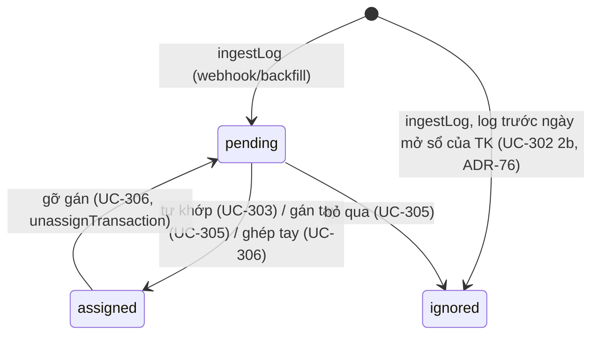

# Entity Model — ingest

Context này sở hữu hai entity: **BankLog** (lớp 1, thô) và **Rule** (quy tắc tự gán).
Tham chiếu theo tên (không sở hữu): Transaction, Account, TransferOrder (ledger/allocation), AllocationRun (allocation),
Notification (notify), SepayConnection + Config (access), IncomeStream (allocation), Tenant (rental).

## BankLog (`bank_logs`)

**Nghĩa:** một biến động ngân hàng mà SePay báo về (webhook) hoặc rà soát đêm kéo về (backfill). Là **sự thật thô**:
lưu nguyên payload, không diễn giải. Giao dịch sổ sách (Transaction) được sinh *từ* log, trỏ ngược qua `log_id`/`log_id_2`.

### Trường mang nghĩa nghiệp vụ
| Trường | Luật |
|---|---|
| `id` | Id SePay (`payload.id` / `row.id`, ép chuỗi). Khoá chính → chống trùng khi SePay gửi lại cùng id (`ingestLog`). Id webhook và id API lịch sử **không được giả định là giống nhau** (`plans/reports/researcher-260921-2228-third-party-assumptions.md` A.5) |
| `at` | Thời điểm giao dịch, lưu ISO UTC (`…Z`), đổi từ `YYYY-MM-DD HH:mm[:ss]` giờ VN; ngày không có thật bị từ chối (`vnDateTimeToIso`) |
| `amount` | INTEGER VND > 0 (`CHECK (amount > 0)`), ≤ 1.000.000.000.000 (`vndAmount`) |
| `direction` | `in` \| `out` (`CHECK`); webhook lấy từ `transferType`, API lịch sử suy từ `amount_in > 0` |
| `account_id` | TK của hộ, tra theo `sub_account` (tài khoản ảo) trước rồi `account_no`, **chỉ trong các TK thuộc kết nối SePay đã gửi log** (`accounts.sepay_connection_id`, ADR-75); không tra được → `NULL`, log vẫn được lưu `pending` |
| `account_no` | Số TK thô từ payload (giữ lại cả khi không tra được) |
| `content` | `payload.content ?? payload.description` (webhook) / `transaction_content` (API) |
| `ref_code` | `payload.code ?? extractCode(content)`, viết hoa — mã `[QE]xx` cho rule loại `code` |
| `reference_number` | Mã FT ngân hàng (`referenceCode` / `reference_number`). Duy nhất trong một TK khi khác NULL/rỗng (`idx_logs_ref`, migration 0005) |
| `raw` | JSON nguyên văn payload/dòng API — bản lưu đối chiếu duy nhất của mọi trường SePay gửi mà app không dùng, kể cả số lũy kế (`accumulated`): không đọc, không lưu cột riêng, không so (cột `accumulated` bỏ ở migration 0023, ADR-87) |
| `source` | `webhook` \| `backfill` (`CHECK`) |
| `status` | `pending` \| `assigned` \| `ignored` (`CHECK`), mặc định `pending` |
| `received_at` | Giờ server nhận, khuôn `YYYY-MM-DD HH:MM:SS` UTC (`sqliteDateTime`) — cron báo chưa gán (notify UC-407) so theo cột này |

### Trạng thái

`ignored` là trạng thái cuối: không có đường nào trong code đưa log `ignored` về `pending`. Log ghi thẳng `ignored` vì trước ngày mở sổ (`opened_at`) không khác gì log người bấm Bỏ qua — chỉ phân biệt được bằng cách so ngày log với `opened_at`.

### Quan hệ
- 1 BankLog → 0..N Transaction `active` qua `transactions.log_id` (tách nhiều dòng khi gán tay).
- 1 Transaction `transfer` ghép cặp → 2 BankLog (`log_id` = chân ra hoặc chân về / được ghi trước, `log_id_2` = chân còn lại — kể cả chân gắn sau vào chuyển nội bộ đã ghi, ADR-81).
- 0..1 TransferOrder trỏ tới log đã hoàn tất nó (`transfer_orders.matched_log_id`).
- N BankLog → 0..1 Account (`account_id`).

### Bất biến (và nơi thực thi)
| # | Bất biến | Thực thi |
|---|---|---|
| I1 | Một id SePay → một log | PK `bank_logs.id` + `INSERT OR IGNORE` (`ingestLog`) |
| I2 | Một `(account_id, reference_number)` khác rỗng → một log | Kiểm trước trong `ingestLog`; `UNIQUE INDEX idx_logs_ref … WHERE reference_number IS NOT NULL AND reference_number <> ''` (`migrations/0005_ingest_integrity_guards.sql`) |
| I3 | Chỉ log `pending` mới sinh được giao dịch; cả hai chân của cặp đều phải `pending` | Trigger `trg_tx_needs_pending_log` (INSERT), `trg_tx_second_leg_needs_pending_log` (UPDATE `log_id_2`) — migration 0005 |
| I4 | Ghi giao dịch và đổi log sang `assigned` là một khối nguyên tử | `commit()` = một `db.batch([... , markAssigned])` (`src/services/ingest.ts`) |
| I5 | Tổng các giao dịch tách từ một log = `log.amount` | `assignLog` (`split_mismatch`) |
| I6 | Nội dung log (mọi cột trừ `status`) không bị sửa | Chỉ theo quy ước: `src/` chỉ có `UPDATE bank_logs SET status …`; **không có trigger DB** chặn |
| I7 | Log `assigned` luôn có ≥1 giao dịch `active` trỏ tới nó (trừ khi gỡ) | Theo luồng code (`markAssigned` chung batch; `unassignTransaction` void hết rồi mới trả `pending`); không có ràng buộc DB |

## Rule (`rules`)

**Nghĩa:** quy tắc để máy tự diễn giải một log. Theo luật 6 (`docs/core_design_rules.md` §1): máy chỉ được đoán
`spend`/`transfer`; `income` chỉ cho mẫu lương.

| Trường | Luật |
|---|---|
| `match_type` | `code` (so khớp chính xác với `ref_code`) \| `content` (chuỗi con trong nội dung đã bỏ dấu, viết hoa, gộp khoảng trắng) \| `account` (hiện cũng là chuỗi con trong nội dung chuẩn hoá — xem [DIVERGENCE] ở UC-307) |
| `pattern` | So không phân biệt hoa thường (`matchRule` viết hoa pattern) |
| `priority` | Số nhỏ thắng trước, **trong cùng một `match_type`**; mặc định 100 |
| `meaning` | `spend` \| `transfer` \| `income` (`CHECK`) |
| `is_salary` | `income` bắt buộc `is_salary=1` (`CHECK (meaning <> 'income' OR is_salary = 1)`, `createRule` → `income_needs_salary`); rule người thuê được `createRule` tự đặt `is_salary=1` |
| `wallet_id` | `spend`: ví bị trừ (`counter_wallet_id`); `income`: ví nhận (`wallet_id`); `transfer` có `from_wallet_id`: ví đích của chuyển ví (`wallet_id`) |
| `category_id` | `spend` thiếu danh mục → không tự gán, chỉ gợi ý ở màn Gán |
| `by_member_id` | Nhãn "ai chi"; với `transfer` không có `counter_account_id` dùng để tìm TK tiền mặt đích |
| `active` | Chỉ rule `active=1` được nạp để khớp (`loadRuleRows`) |
| `income_stream_id` | Chỉ cho rule `income` (`createRule` → `income_only`; `updateRule` → `invalid_input`): khoản thu tự ghi từ mẫu lương mang nguồn này, lần chia theo phần khóa của nguồn (ADR-59). NULL = luật % chung như cũ. Migration 0007 |
| `tenant_id` | Rule người thuê: chỉ `income` (`tenant_rule_income_only`), người thuê phải có (`unknown_tenant`). **Không bao giờ tự gán**: `matchLog` lọc bỏ rule có `tenant_id`; `suggestFor` chỉ dùng nó để gợi ý "Thu từ <tên>" cho log `in` (ADR-60). Migration 0007 |
| `account_id` | Rule chỉ áp cho log của đúng tài khoản này, cả khi tự khớp (UC-303) lẫn khi gợi ý (UC-305); NULL = mọi tài khoản như cũ. Migration 0017 (schema v1.17, ADR-77) |
| `counter_account_id` | Chỉ có nghĩa với `transfer`: tài khoản đầu kia — log `out` tự gán chuyển nội bộ TK log → tài khoản này thay vì tìm TK tiền mặt; log `in` khớp cùng mẫu chỉ được **gợi ý** chuyển ngược lại (rút heo về: chỉ chuyển tài khoản, không chuyển ví — ADR-82), không bao giờ tự gán. Log có ngày VN trước `opened_at` của tài khoản này → không tự gán. NULL = rút tiền mặt như cũ. Migration 0017 |
| `from_wallet_id` | Đi cùng `counter_account_id` + `wallet_id`: dòng `transfer` kèm chuyển ví `from_wallet_id` → `wallet_id` (bỏ heo đất: Có thì tốt → Tích sản, ADR-82); chỉ dùng cho log `out` — gợi ý tiền về không mang ví. Migration 0017 |

**Thứ tự khớp:** mọi rule `code` → mọi rule `content` → mọi rule `account`; trong mỗi nhóm theo `priority` tăng dần; rule
đầu tiên khớp thắng (`matchRule`). Rule `income` chỉ đủ điều kiện khi `direction='in'` **và** `is_salary`; rule `spend`/`transfer`
chỉ đủ điều kiện khi `direction='out'`. Rule mang `tenant_id` không tham gia tự khớp (UC-303), chỉ tham gia gợi ý tiền vào (UC-305).
Rule có `account_id` chỉ được xét cho log của tài khoản đó. Rule `transfer` có `counter_account_id` còn được xét (như thể khớp tiền
vào) để gợi ý chiều ngược lại cho log `in` của chính tài khoản đó (UC-305).

**Seed:** `0002_seed.sql` (`LUONG THANG` → income lương, `EAN`, `EPL`); `0004_sepay_rules.sql` (`EXE`, `EMS`, `XANG`, `SHOPEE`,
`LAZADA`, `TIKI`; cố ý không seed `QTT`); `0017_heo_dat.sql` (heo đất, ADR-77 — chỉ khi có tài khoản `locked`: với mọi tài khoản
MBBank `bank` đang dùng, không khóa, của người có heo, hai rule `content` `transfer` `CHUYEN TIEN LE LAM TRON` (priority 10) và
`TIET KIEM TIEN LE` (priority 11), `account_id` = tài khoản đó, `counter_account_id` = heo của chủ nó, `from_wallet_id = nice-to-have`,
`wallet_id = heo-dat`, `by_member_id` = chủ tài khoản); `0019_heo_settlement_rule.sql` (thêm mẫu `TICH LUY`, priority 12, cùng
tài khoản / ví); `0020_heo_tich_san.sql` (ADR-82 — `wallet_id` `heo-dat` → ví Tích sản đang dùng, prod `wealth-building`; ví `heo-dat` tắt).

**Bất biến:**
- R1 Rule không bao giờ sinh `refund`/`lend`/`buy_asset`: `CHECK (meaning IN ('spend','transfer','income'))`, `RULE_MEANINGS`.
- R2 Rule `income` không có `is_salary` không tồn tại được: DB `CHECK` + `createRule` + `updateRule` (`src/services/settings.ts`).
- R3 Rule sinh từ một lần gán tay chỉ được là `spend`/`transfer`: `createRuleFromSplit` (`rule_meaning_restricted`) + route (`rule_not_allowed`).
- R4 Rule người thuê không bao giờ sinh giao dịch: `matchLog` lọc `!tenantId` trước `matchRule` (`src/services/ingest.ts`, ADR-60); không có ràng buộc DB.
- R5 Rule gắn tài khoản không áp cho log của tài khoản khác: `matchLog` và `suggestFor` lọc `!accountId || accountId === log.account_id` (ADR-77); không có ràng buộc DB. Ba cột `account_id`, `counter_account_id`, `from_wallet_id` chỉ đặt được bằng migration (`createRule`, `createRuleFromSplit`, `updateRule` không nhận).
